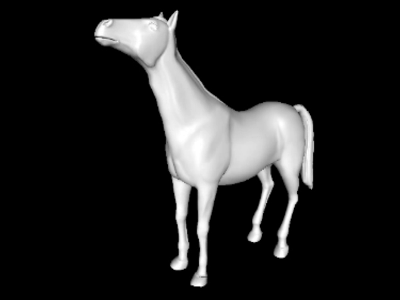

# animator
Pose animation app.

This application interpolates 3D pose mesh files and displays an interactive
animation.



The building system only supports Linux systems at the moment, although it
should be straightforward to port it to other platforms.

## Requirementes

* [surfmorph](..) (included in the repository)
* [Eigen](http://eigen.tuxfamily.org)
* [OpenMesh](http://www.openmesh.org)
* [Qt 5](https://www.qt.io)
* [libQGLViewer](http://libqglviewer.com)

## Compilation

Clone this repository and navigate to this directory. Then run:

```Shell
$ mkdir -p build
$ cd build
$ qmake ..
$ make
```

## Usage

After compiling, an executable `animator` should have been created in the
`build` directory. The program must be called from a command line with the
following syntax:

```Shell
$ ./animator [options] <pose files...>
```

Where `pose files...` must be two or more mesh files containing the different
poses of the model. The mesh files must have the same number of vertices and
triangle structure, and the vertex indices must be registered correspondingly.
The posible values for `options` are:
* `-f|--fps <fps>` to specify the frame rate of the animation.
* `-d|--duration <seconds>` to specify the duration of the animation.
* `-h|--help` to show a help message.
* `-v|--version` to show the application version.

After computing the animation frames, the animation will play repeatedly in an
interactive window. Press **H** key to see an integrated help window. The
controls of the animation window are basically the default controls defined by
[libQGLViewer](http://libqglviewer.com), with the following additions:
* Press **+** to accelerate the animation.
* Press **-** to decelerate the animation.
* Press **B** to enable or disable the backwards animation in the loop.
